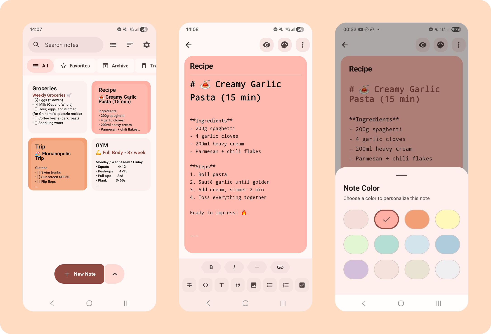
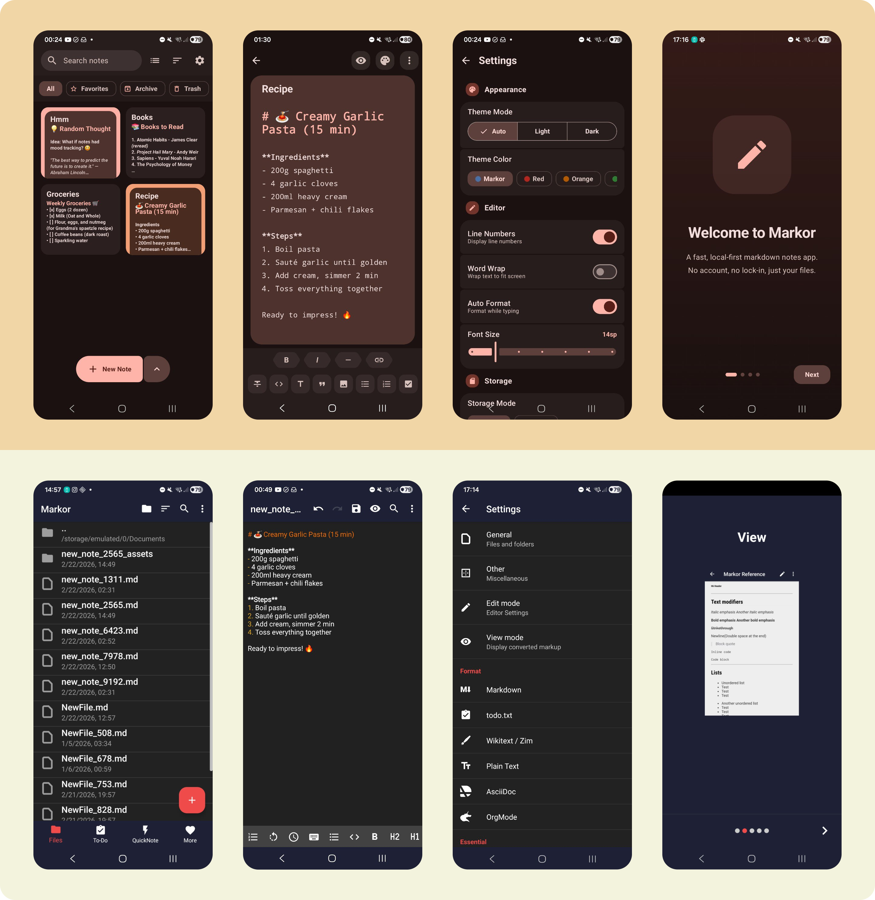

# Re-Markor (Compose + KMP + M3)

<p align="center">
  
</p>

<p align="center">
  <strong>Local-first, Markdown-centric, Multiplatform notes.</strong><br>
  Built with Kotlin Multiplatform and Compose Multiplatform.
</p>

<p align="center">
  <a href="https://kotlinlang.org/"></a>
  <a href="https://www.jetbrains.com/lp/compose-multiplatform/"></a>
  <a href="LICENSE.txt"></a>
  <a href="#"></a>
</p>

---

Re-Markor is a modern, cross-platform port of the original [Markor](https://github.com/gsantner/markor) project. It preserves the core philosophy—plain text files, offline-first workflow, and no account lock-in—while leveraging **Kotlin Multiplatform (KMP)** to bring a unified experience to Android and iOS.

## 🚀 Key Features

- 📝 **Markdown-First:** Fast editing with live preview and syntax highlighting.
- 🌍 **Multiplatform:** Shared business logic and UI across Android, iOS, and JVM.
- 📂 **Local-First:** Your data stays on your device in plain text files.
- 🏷️ **Smart Organization:** Pinned notes, archive, labels, trash, and recents.
- 🎨 **Modern UX:** A complete redesign using Material 3 and Compose Multiplatform.
- 🖼️ **Asset Aware:** Built-in support for images and attachments within your notes.

## 📸 Screenshots



## 🛠️ Tech Stack

This project is a showcase of modern Kotlin Multiplatform development:

- **UI:** [Compose Multiplatform](https://www.jetbrains.com/lp/compose-multiplatform/) (Material 3)
- **Database:** [Room](https://developer.android.com/kotlin/multiplatform/room) (KMP)
- **Dependency Injection:** [Koin](https://insert-koin.io/)
- **Navigation:** [Navigation 3](https://developer.android.com/jetpack/compose/navigation)
- **Preferences:** [DataStore](https://developer.android.com/topic/libraries/architecture/datastore) (KMP)
- **Concurrency:** [Kotlinx Coroutines](https://github.com/Kotlin/kotlinx.coroutines)
- **Serialization:** [Kotlinx Serialization](https://github.com/Kotlin/kotlinx.serialization)
- **Images:** [Coil3](https://coil-kt.github.io/coil/) (KMP)
- **Theming:** [Material Kolor](https://github.com/jordond/MaterialKolor) (Dynamic Color)

## 🏗️ Project Structure

The project follows a standard KMP layout:

- `shared/`: The heart of the app. Contains common UI (Compose), business logic, and data layers (Room, DataStore).
- `app/`: Android-specific entry point and resources.
- `iosApp/`: iOS-specific Xcode project and Swift entry point.
- `metadata/`: App store metadata and screenshots.

## 🏁 Getting Started

### Prerequisites

- **JDK 17** or higher.
- **Android Studio** (Koala or newer) with the KMP plugin.
- **Xcode 15+** (for iOS development).
- **CocoaPods** (if applicable) or Swift Package Manager.

### Build & Run

#### Android
```bash
./gradlew :app:installFlavorDefaultDebug
```

#### iOS
1. Open `iosApp/iosApp.xcodeproj` in Xcode.
2. Select a simulator or device.
3. Click **Run**.

Alternatively, via CLI:
```bash
./gradlew :shared:embedAndSignAppleFrameworkForXcode
```

## 📜 Credits & License

- **Original Project:** [Markor](https://github.com/gsantner/markor) by Gregor Santner.
- **License:** Apache License 2.0. See [LICENSE.txt](LICENSE.txt) for details.

---
<p align="center">Made with ❤️ using Kotlin Multiplatform</p>
